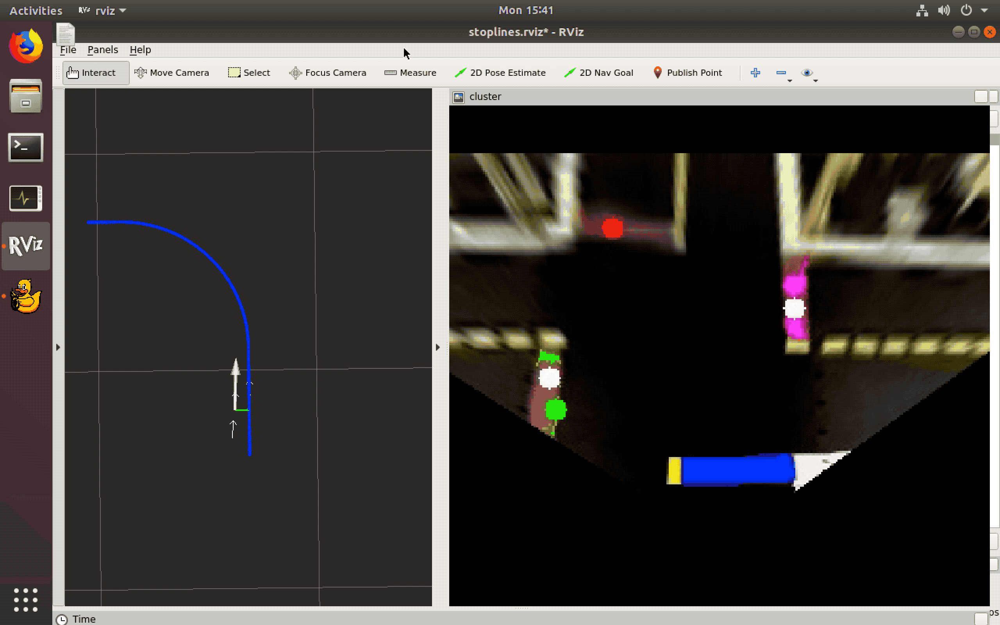

# Intersection Navigation Demo
The following are instructions to set up and run the Intersection Navigation Demo.

This demo uses the Intersection Navigation solution proposed by the Fall 2019 ETH AMOD `proj-lfi` group.

## Video of expected results


## Cloning the repository
```
git clone https://github.com/duckietown-ethz/proj-lfi.git
cd proj-lfi
# Fetch submodule for slightly modified car-interface
git submodule update --init
```

## Building `proj-lfi`
```
dts devel build -f --arch arm32v7 -H DUCKIEBOT_NAME.local
```
## Building `proj-lfi-car-interface`
```
cd car-interface
dts devel build -f --arch arm32v7 -H DUCKIEBOT_NAME.local
```

## Before running the demo
- Make sure kinematics calibration isn't too bad (up to 0.2m side drift per meter travelled straight in open loop is acceptable)
- Shutdown all `dt-car-interface`, `dt-duckiebot-interface` and `dt-core` containers.
- Ensure lighting is consistent 

## Running the demo
### Start supporting containers
```
dts duckiebot demo --demo_name all_drivers --duckiebot_name DUCKIEBOT_NAME --package_name duckiebot_interface --image duckietown/dt-duckiebot-interface:daffy
dts duckiebot demo --demo_name all --duckiebot_name DUCKIEBOT_NAME --package_name car_interface --image duckietown/proj-lfi-car-interface:daffy-arm32v7
```

### Connect a Keyboard controller
```
dts duckiebot keyboard_control DUCKIEBOT_NAME --base_image duckietown/dt-core:daffy-amd64
```
If the robot can be moved around manually the supporting containers have started correctly and you can proceed. 

Leave the Keyboard controller open to start lane following later. 

### Adjust parameters of other nodes 
Fire up a container for communicating with the nodes on the Duckiebot from your computer.
```
dts start_gui_tools DUCKIEBOT_NAME --base_image duckietown/dt-core:daffy-amd64
```
Lower the camera resolution to speed up image processing, localization resolution is still better than what the controller can achieve. In the container:
```
rosparam set /DUCKIEBOT_NAME/camera_node/res_h 192 && rosparam set /theducknight/camera_node/res_w 256
```
Lower the maximum angular velocity command, this prevents the robot from turning too sharply or on the spot. Turning on the spot will cause objects in the robot's view to move too fast, possibly leading to tracking failure and hence incorrect localization.
```
rosparam set /DUCKIEBOT_NAME/kinematics_node/omega_max 4
```
Slow down the robot a little. (The effect of this adjustment depends on `gain` parameter calibration, as different robots move at different velocities for the same motor commands)
```
rosparam set /theducknight/kinematics_node/v_bar 0.15
```

Leave this shell open, you can use it later to change which turn the robot will take and enable additional visualization. 

You can also `rqt_console &` or `rqt_plot &`.

### Run the localization pipeline
```
dts duckiebot demo --demo_name proj-lfi --duckiebot_name DUCKIEBOT_NAME --package_name estimator --image duckietown/proj-lfi:master-arm32v7 --debug
```
All the nodes might take a couple of minutes to start up. When everything is ready `/DUCKIEBOT_NAME/lane_controller_node/intersection_navigation_pose` will be constantly published. You can check it with the `rostopic` command line tool.

### Make the Duckiebot drive 
- Place Duckiebot in a lane directed towards a four way intersection.
- Start lane following with the keyboard controller. 

The robot will drive up to the stop line and stop for two seconds. It will then traverse the intersection.
- Stop lane following with the keyboard controller.

#### Change the direction it takes
For the demo, the direction in which the robot will exit the intersection is set via a ROS parameter.
The default is going straight. It can be changed in real time by issuing one of the follwing commands:
```
rosparam set /DUCKIEBOT_NAME/virtual_lane_node/trajectory left
rosparam set /DUCKIEBOT_NAME/virtual_lane_node/trajectory right
rosparam set /DUCKIEBOT_NAME/virtual_lane_node/trajectory straight
```
The intersection navigation system is not informed about the kind of intersection (3-way or 4-way), nor about the direction from which it approaches three way intersections. 

If you do not stop lane following, the demo will continue indefinetely. The robot will however likely leave the road if setup to make an impossible turn.

### Visualization 
Visualization is useful to understand or debug the stopline based localization. 

Enable publication of the stopline detection debug image and all candidate pose estimates:
```
rosparam set /DUCKIEBOT_NAME/localization_node/verbose 1
``` 
Enable visualization of the trajectory in rviz:
```
rosparam set /DUCKIEBOT_NAME/virtual_lane_node/verbose 1
``` 
Enabling verbose on these nodes will also send a lot of additional information to the log and will have a negative performance impact.

We included an rviz configuration file in the `rviz` directory but the duckiebot name has to be manually updated in the ROS topics.

NOTE: The localization debug image is not published when the node is not active (eg. in lane following mode). For convenience we have set the finite state machine to also activate the node during Keyboard Control.

When the Finite State Machine switches from to `INTERSCTION_CONTROL` after arriving at a stop line the localization is reset. This switch does not happen when using the keyboard controller. To achieve the same result, you can enable lane following and disable it again before the robot starts moving.

Before entering the intersection the closest stopline (the one the robot stopped at) must be highlighted in blue.
Correct re-detection of the stoplines can be verified by the highlight colors of the stoplines remianing constant.


As an example failure case, the following video shows the clustering algorithm mistaking a stop line for another. The stopline marked in red changes from being the one in front to the one on the left.


### Adjusting parameters:
Parameters can be adjusted to tune resource usage, localization performance and planning.
#### `virtual_lane_node/`
Name | Description
---|---
`verbose` | Enable verbose logging and publish trajectory for visualization
`trajectory` | Trajectory to follow across the intersection (either `left`, `right` or`straight`)
`end_condition_distance_right`  `end_condition_distance_left` `end_condition_distance_straight` | Maximum distance in meters from the end of the planned trajectory to switch back to lane following. The trajectory overlaps with exit lane by about 0.2m
`end_condition_angle_deg_right` `end_condition_angle_deg_left` `end_condition_angle_deg_straight` | Maximum angle in degrees between the robot and the exit lane to switch back to lane following
`y_offset_right` `x_offset_right` | *Legacy* - Translates the trajectory for right turns to avoid cutting the corner or invading the other lane. This has not been used since the default trajectory has been changed to a larger radius


#### `localization_node/`
Name | Description
---|---
`verbose` | Boolean - Publish debug image, all candidate poses and log additional information
`start_x` `start_y` | Initial guess for the localization when the robot stops at the stopline. The intersection coordinate system origin is in the center of the stopline the robot stops at. The x axis is oriented right and the y axis is oriented forwards.
`dbscan_eps` | Minimum distance between red pixels to be considered neighbours.
`dbscan_min_samples` | Minimum number of neighbours for a red pixel to be considered a core point.
`min_quality` | Ratio between the area of a cluster and that of a full stopline for it to be used for estimating the pose
`integration_enabled` | Boolean - Keep track of the pose from the `velocity_to_pose_node` to estimate the pose when no clusters satisfy `min_quality`. 
`damping` | Boolean - Enable a "trick" to slow down the change in heading from the integrated pose. Integrating the motor commands in a kinematic model overestimates the yaw rate.
`omega_factor` | Factor by which to reduce the estimated yaw rate if `damping` is True. (default=0.2)
`integration_assisted_clustering` | Boolean - Use the integrated pose to predict the next location of the stoplines. This reduces the likelihood of misclassifying stoplines if the robot moves fast or frames are skipped.
`stop_time` | Seconds - For the demo, time to wait at the stopline.
`show_time_keeping` | Boolean - Output code profiling in the logs. (Show delay across exceution of the algorithm)

#### `birdseye_node/`
Name | Description
---|---
`verbose` | Enable additional logging and publishing of rectified images
`rectify` | Rectification is required for correct ground reprojection, set to False to bypass it. (Untested)

Adjusting parameters in `lane_controller_node` and `kinematics_node` can be useful to improve trajectory tracking performance.

## Measuring latency with ROS message timestamps
**Relies on wall clock synchronization**, so it's more reliable if you run it via a shell attached to a container running on the Dubkiebot.
The output is negative seconds and positive nanosecods which may be counter-intuitive. As an example, "-1 s  9000000000 ns" equates to a 0.1 sec delay.
```
rostopic echo --offset /DUCKIEBOT_NAME/lane_controller_node/intersection_navigation_pose/header
```

# `proj-lfi` code structure
All the code is contained in two Docker Images.
1. `proj-lfi-car-interface` is a custom version of `dt-car-interface`, is was only modified to work without obstacle avoidance 
2. `proj-lfi` is derived from `dt-core` and contains three packages:
 - `estimator` with the localization pipeline
 - `anti-instagram` with a modified anti-instagram node that does not do scaling by default
 - `fsm` with a custom finite state machine configuration file to integrate our nodes


